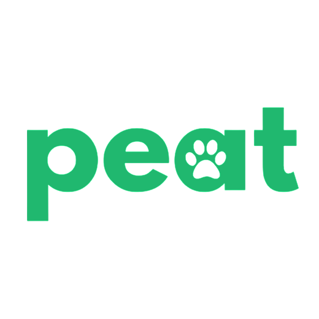
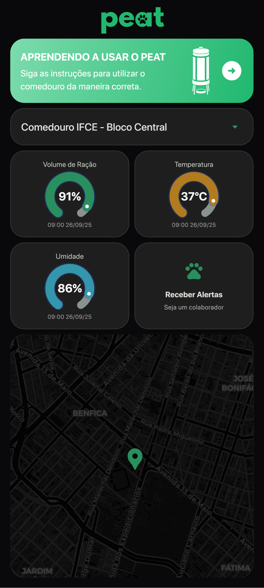
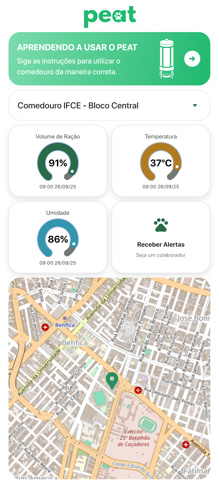
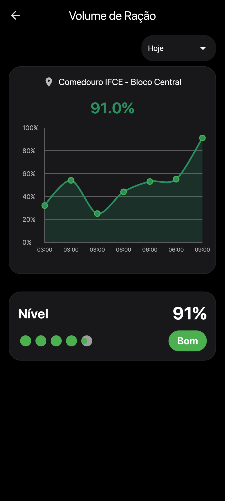
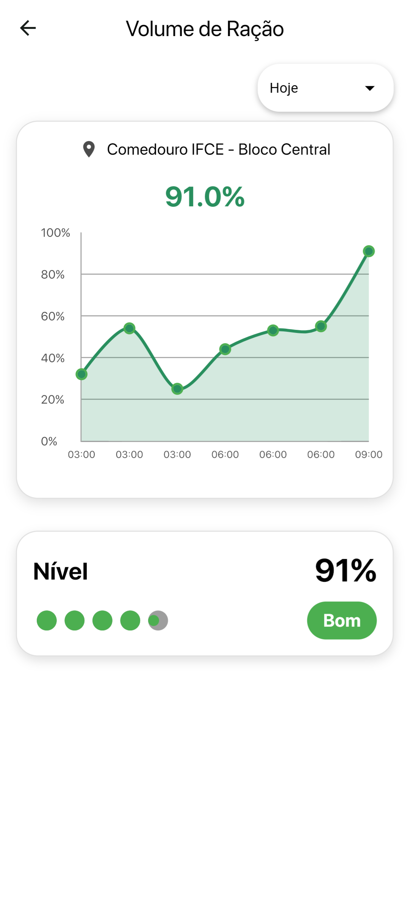
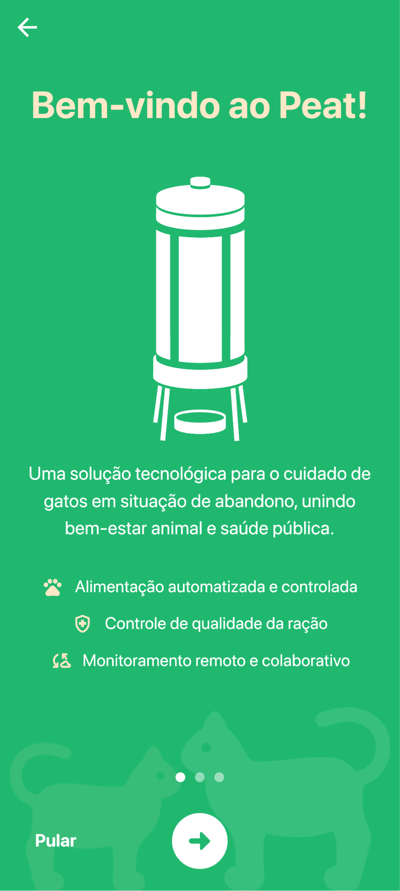
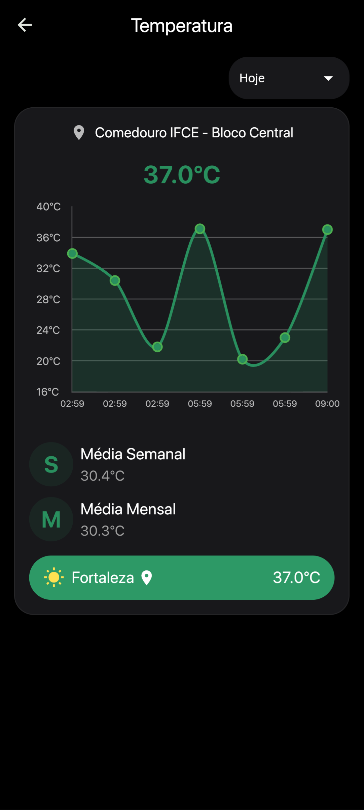
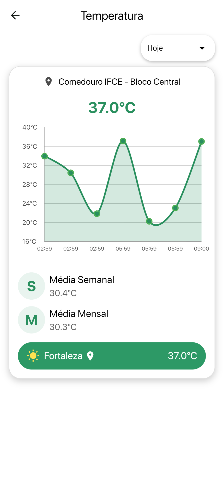
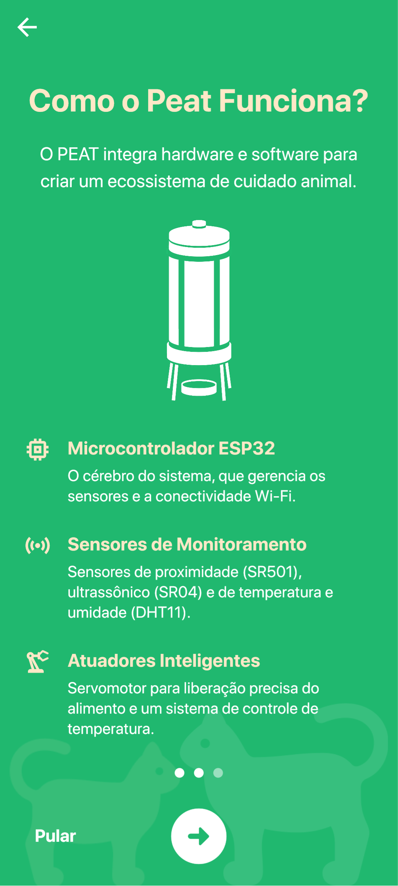
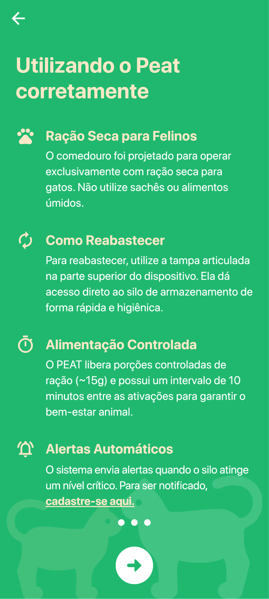

# Peat Dashboard

<p align="center">
  
</p>

<p align="center">
  <strong>A comprehensive dashboard for visualizing data from the Peat API.</strong>
</p>

<p align="center">
  
  
  
</p>

---

## Table of Contents

- [Description](#description)
- [Screenshots](#screenshots)
- [Getting Started](#getting-started)
- [Installation](#installation)
- [API](#api)
- [Project Structure](#project-structure)
- [Technologies Used](#technologies-used)
- [License](#license)

---

## Description

**Peat Dashboard** is a Flutter-based application designed to display real-time data fetched from the **Peat API**.  
It uses **environment variables** to securely configure the API connection and authentication, ensuring flexibility and
protection of credentials.

---

## Screenshots

<p align="center">
    
    
    
      
    

</p>

<p align="center">
    
    
    
    
</p>

---

## Getting Started

### Prerequisites

- [Flutter SDK](https://docs.flutter.dev/get-started/install) installed
- A device or emulator set up for Flutter (**Chrome recommended**)

---

## Installation

Follow the steps below to set up and run the project locally.

1. **Clone the repository**

```bash
git clone https://github.com/viniciusmecosta/PeatDashboard.git
cd PeatDashboard
````

2. **Create a `.env` file** in the project root, based on the `assets/example.env` file. Example content:

```env
BASE_URL=http://127.0.0.1:8002
API_TOKEN=your_token_here
```

> This file is required to connect the application to the API.

3. **Install dependencies**

```bash
flutter pub get
```

4. **Run the application**

```bash
flutter run
```

> When prompted to select a device, choose **Chrome** for best compatibility.

---

## API

This application consumes data from the [Peat Data API](https://github.com/viniciusmecosta/PeatData), which serves as
the backend providing all the information displayed on the dashboard.

---

## Project Structure

```
PeatDashboard/
├── android/              # Android platform-specific files
├── assets/               # Images, fonts, and other assets
│   ├── fonts/            # Custom fonts
│   └── Screens/          # Screenshot images
├── ios/                  # iOS platform-specific files
├── lib/                  # Main application source code
│   ├── models/           # Data models for the application
│   ├── screens/          # UI screens (pages)
│   ├── services/         # Services for API communication
│   ├── utils/            # Utility functions and helpers
│   └── widgets/          # Reusable UI components
├── web/                  # Web platform-specific files
├── .env                  # Environment variables (create this)
└── README.md
```

---

## Technologies Used

The main libraries and technologies used in this project include:

* **State Management:** `provider`
* **Charts:** `fl_chart`
* **UI:** `google_fonts`, `sleek_circular_slider`
* **HTTP Requests:** `http`
* **Maps:** `flutter_map`, `latlong2`
* **Environment Variables:** `flutter_dotenv`
* **Utilities:** `intl`, `url_launcher`

---
